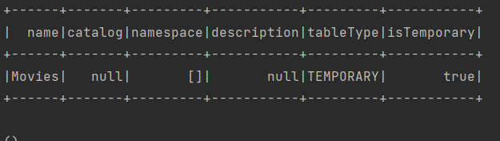

<div id="top"></div>


<!-- PROJECT LOGO -->
<br />
<div align="center">
    
  
</div>


<!-- TABLE OF CONTENTS -->
<details>
  <summary>Table of Contents</summary>
  <ol>
        <li><a href="#introduction">Introduction</a></li>
        <li><a href="#objectifs">Objectifs</a></li>
        <li><a href="#code_et_outputs">Code et Outputs</a></li>
       
  </ol>
</details>

- # [Introduction](#Introduction)

Spark SQL est un élément clé du framework Apache Spark, fournissant une interface SQL pour l'analyse et la manipulation de grandes quantités de données. Elle facilite la gestion de grands ensembles de données en permettant aux utilisateurs de travailler avec des données structurées et semi-structurées en utilisant des requêtes SQL. Spark SQL peut interagir avec plusieurs sources de données, telles que Hive, Parquet et JSON, et bénéficie d'optimisations de performance pour traiter efficacement les données sur des clusters distribués. Que vous soyez un ingénieur en données, un scientifique des données ou un développeur, Spark SQL facilite la manipulation et l'analyse de grandes quantités de données, aidant ainsi à extraire efficacement des informations précieuses de vos données. 

- # [Objectifs](#Objectifs)
L'objectif principal de cette première section est de présenter les bases de Spark SQL en mettant en avant son abstraction de base, ses opérations structurées de manipulation de données et les différentes sources de données prises en charge pour la lecture et l'écriture. L'apprentissage de la création de DataFrames par transformation d'un RDD, programmation ou chargement de données de sources externes est l'un des objectifs spécifiques. De plus, il vise à familiariser les participants avec l'utilisation de l'API DataFrame pour des tâches telles que la sélection, le filtrage, le tri et le regroupement de données, l'application de fonctions SQL sur les DataFrames, la conversion des DataFrames en RDD et l'enregistrement des données dans des sources externes.Enfin, cette section présente un aperçu des DataSets qui ont été introduits avec Spark 1.6. Il explique également comment créer des DataFrames à partir de requêtes SQL et comment exécuter ces requêtes sur les données DataFrame. Pour une compréhension approfondie de ces concepts, une connaissance de base de SQL est recommandée.

  
- # [Code et Outputs](#code_et_outputs)
   ## Librairies:
  ```scala
import org.apache.spark.sql.functions.{col, count, lit}
import org.apache.spark.sql.types.StructType
import org.apache.spark.sql.{Column, DataFrame, Dataset, Row, SparkSession, functions}
import org.apache.spark.sql.types.{BooleanType, LongType, StringType, StructField, StructType}

import scala.collection.immutable.BitSet.empty
import scala.collection.immutable.Seq
  def getConfiguration(): SparkSession = {
    val spark = SparkSession.builder().appName("SparkApp3_Scala").master("local[*]").getOrCreate()
    spark
  }```


# Création des Dataframes:
  ## Création par différentes méthodes:
  ```scala
  //-------------II. Manipulation des DataFrames-----------------------
  def add_column(df: DataFrame): DataFrame = {
    // Ajouter une nouvelle colonne avec une valeur constante
    val df_new = df.withColumn("ID", lit(10))
    // Ajouter une nouvelle colonne à partir d’une autre colonne
    val df_new2 = df.withColumn("ID", df.col("produced_year") >= 2000)
    val df_new3 = df.withColumn("produced_decade", (df.col("produced_year") - df.col("produced_year") % 10))
    // Ajouter une nouvelle colonne en changeant le type de colonne
    val df_new4 = df.withColumn("PY", df.col("produced_year").cast("Long"))
    df_new4
  }

  def renommer_column(df: DataFrame): DataFrame = {
    val df_rename =
      df.withColumnRenamed("actor_name", "actor").withColumnRenamed("movie_title", "title")
        .withColumnRenamed("produced_year", "year")
    df_rename
  }

  def drop_column(df: DataFrame): DataFrame = {
    df.drop("actor_name", "column_x")
  }

  def sample_Trans(df: DataFrame): DataFrame = {
    // échantillon avec un ratio et sans remplacement
    val sample1 = df.sample(false, 0.0004)
    // échantillon avec remplacement, un ratio et une graine (seed)
    val sample2 = df.sample(true, 0.0003, 123)
    sample1
     //return sample2
  }
  def select_Version(spark : SparkSession, df : DataFrame) : DataFrame = {
    import spark.implicits._
    val df1 = df.select('movie_title, ('produced_year - ('produced_year %
      10)).as("produced_decade"))
    val df2 = df.select('movie_title)
    val df3 = df.select('movie_title, (functions.length(df.col("movie_title")) >= 10)
      .as("new_column"))
    val df4 = df.select(df.columns(0))
    val df5 = df.select(df.columns.slice(0,2).map(m => col(m)):_*)
    return df3 // return df1 // return df2 // return df4 // return df5
  }
  def randomSplit_Trans(df: DataFrame): Array[DataFrame] = {
    // les poids doivent être sous forme d'un tableau
    val petitsDFs = df.randomSplit(Array(0.5, 0.3, 0.2))
    petitsDFs
  }

  def selectExpr_Version(df: DataFrame): DataFrame = {
    val df1 = df.selectExpr("*", "(produced_year - (produced_year % 10)) as decade")
    return df1
  }

  def selectExpr_Version2(df: DataFrame): DataFrame = {
    val df1 = df.selectExpr("count(distinct(movie_title)) as movies_nbr", " count (distinct(actor_name)) as actors_nbr")
    return df1
  }

  def filtrage(spark: SparkSession, df: DataFrame): DataFrame = {
    import spark.implicits._
    val df1 = df.filter('produced_year === 1990)
    val df2 = df.select("movie_title",
      "produced_year").where('produced_year =!= 2000)
    val df3 = df.filter('produced_year >= 1998 && functions.length('movie_title) < 7)
    val df4 = df.filter('produced_year >= 2000).filter(functions.length('movie_title) > 10)
    return df4 //return df3 // return df2 // return df1
  }

  def drop_fct(df: DataFrame): DataFrame = {
    val df1 = df.select("movie_title").distinct.selectExpr("count(movie_title) as movies")
    val df2 = df.dropDuplicates("movie_title").selectExpr("count(movie_title) as movies")
    return df1
  }

  def tri_fcts(spark: SparkSession, df: DataFrame): DataFrame = {
    import spark.implicits._
    val df_base = df.dropDuplicates("movie_title").selectExpr("movie_title"
      , "length(movie_title) as title_length", "produced_year")
    val df1 = df_base.sort('title_length)
    val df2 = df_base.orderBy('title_length.desc)
    //Tri par deux colonnes
    val df3 = df_base.orderBy('title_length.desc, 'produced_year)
    return df3 //return df2 // return df1
  }

  def limit_fct(spark: SparkSession, df: DataFrame): DataFrame = {
    import spark.implicits._
    // Creation du DataFrame avec nom acteur et sa longueur associée
    val df_actname =
      df.select("actor_name").distinct.selectExpr("*", "length(actor_name) as length")
    // classer les noms par longueur et récupère le top 10
    val df_limit = df_actname.orderBy('length.desc).limit(10)
    return df_limit
  }

  def union_fct(spark: SparkSession, df: DataFrame): DataFrame = {
    import spark.implicits._
    // Selectionner les films que nous voulons ajouter l'acteur manquant ("12")
    val movie_selected = df.where('movie_title === "12")
    // creer un DataFrame avec une seule ligne
    val actor_data = Seq(Row("Brychta, Edita", "12", 2007L))
    val addedActor_RDD = spark.sparkContext.parallelize(actor_data)
    val addedActor_DF =
      spark.createDataFrame(addedActor_RDD, movie_selected.schema)
    // union
    val union_DF = movie_selected.union(addedActor_DF)
    return union_DF
  }

  def drop_nullEntries(spark: SparkSession, df: DataFrame): DataFrame = {
    // créer d'abord un DataFrame avec des valeurs manquantes
    val badMovies = Seq(Row(null, null, null), Row(null, null, 2018L), Row("John Doe", "AwesomeMovie", null),Row(null, " Awesome Movie", 2018L),Row(" Mary Jane", null, 2018L))
    val badMRDD = spark.sparkContext.parallelize(badMovies)
    val badMDF = spark.createDataFrame(badMRDD, df.schema)
    // suppression des lignes contenant des données manquantes dans n'importe quelle
    //colonne (deux variantes)
    val df1 = badMDF.na.drop()
    val df2 = badMDF.na.drop("any")
    // suppression des lignes contenant des données manquantes dans chaque colonne
    val df3 = badMDF.na.drop("all")
    // suppression des lignes dans lesquelles la colonne actor_name contenant des données
    //manquantes
    val df4 = badMDF.na.drop(Array("actor_name"))
    //remplir les valeurs manquantes par une valeur définie par l'utilisateur
    val df5 = badMDF.na.fill("EMPTY", Array("actor_name"))
    return df4
  }

  def describe_fct(df: DataFrame): DataFrame = {
    val desc = df.describe("produced_year")
    return desc
  }
```
##DataSets:
```scala
//---------III. DataSets-------------------------
// Définir Movie case class
case class Movie(actor_name: String, movie_title: String, produced_year: Long)

  def convert_DFtoDS(spark: SparkSession, df: DataFrame): Dataset[Movie] = {
    import spark.implicits._
    val MovieDS = df.as[Movie]
    return MovieDS

  }

  def creer_Dataset1(spark: SparkSession): Dataset[Movie] = {
    import spark.implicits._
    val data = Seq(Movie("John Doe", "Awesome Movie", 2018L), Movie("Mary Jane",
      "Awesome Movie", 2018L))
    //1ère Option --> Passer la séquence comme argument de la fonction createDataset
    val MoviesDS1 = spark.createDataset(data)
    //2ème Option --> Créer un RDD et le mettre comme argument de la fonction createDataset
    //val RDD_Data = spark.sparkContext.parallelize(data)
    //val MoviesDS2 = spark.createDataset(RDD_Data)
    return MoviesDS1 //return MoviesDS2
  }

  def creer_Dataset_2(spark: SparkSession): Dataset[Movie] = {
    import spark.implicits._
    val data = Seq(Movie("John Doe", "Awesome Movie", 2018L), Movie("Mary Jane",
      "Awesome Movie", 2018L))
    val MoviesDS = data.toDS()
    return MoviesDS
  }

  def DS_filter(spark: SparkSession, df: DataFrame): Dataset[Movie] = {
    import spark.implicits._
    val moviesDS = df.as[Movie]
    // filtrer les films produits en 2000
    val DS_filter = moviesDS.filter(movie => movie.produced_year == 2000)
    return DS_filter
  }
  def DS_Manipulation(spark: SparkSession, df: DataFrame): Dataset[(String, Long)] = {
    import spark.implicits._
    val moviesDS = df.as[Movie]
    // Effectuer une projection en utilisant la transformation map
    val titleYearPairDS = moviesDS.map(m => (m.movie_title, m.produced_year))
    //Tapez titleYearDS.printSchema pour consulter le schema du Dataset créé
    return titleYearPairDS
  }
  /*def DS_Compile_Error(spark : SparkSession , df : DataFrame) : Dataset[Column] = {
    import spark.implicits._
    // 1er Cas --> le problème n'est pas détecté lors de la manipulation d'un DataFrame (jusqu'à l'exécution)
    val DF1 = df.select('movie_title - 'movie_title)
    // 2ème Cas --> le problème est détecté lors de la compilation
    //val DS2 = df.as[Movie].map(m => 'movie_title - 'movie_title)
    //error: value - is not a member of String
    //return DS2 // return DF1
  }


   */
  def SQL_Use_Case(spark: SparkSession, df: DataFrame): DataFrame = {
    import spark.implicits._
    // Enregistrer le DataFrame en tant que vue temporaire
    df.createOrReplaceTempView("Movies")
    //df.createOrReplaceGlobalTempView("movies_global")
    // Afficher la vue des films dans le catalogue
    println(spark.catalog.listTables().show())
    spark.catalog.listColumns("Movies").show()
    // Simple exécution d'une instruction SQL sans enregistrer la vue
    val selected_DF1 = spark.sql("select current_date() as today , 1 + 100 as value")
    //Sélection à partir de la vue
    val selected_DF2 = spark.sql("select * from Movies where actor_name like'% Jolie %'and produced_year >2009")
    //mélanger des instructions SQL et des transformations sur les DataFrame
    val selected_DF3 = spark.sql("select actor_name, count(*) as count from movies group byactor_name").where('count > 20).orderBy('count.desc)
    // Utiliser une sous-requête pour déterminer le nombre de films produits chaque année .
    // Exploiter """ pour formater une instruction SQL multiligne
    val selected_DF4 = spark.sql(
      """select produced_year, count(*) as count from
  (select distinct movie_title, produced_year from movies) group by
  produced_year""".stripMargin).orderBy('count.desc)
    return selected_DF4 // selected_DF3 //selected_DF2 //selected_DF1
  }

  def sauvegarde_df(spark: SparkSession, df: DataFrame): Unit = {
    // Ecrire les données dans le format CSV, en utilisant # comme délimiteur
    df.write.format("csv").option("sep", "#").save("E:/Apache Spark / Ateliers_Spark / Atelier 3 / CSV_OUTPUT")
    // Ecrire les données dans le format CSV, en utilisant ; comme délimiteur avec overwrite comme mode de sauvegarde df.write.format("csv").mode("overwrite").option("sep", ";").save("E:/Apache Spark / Ateliers_Spark / Atelier 3 / CSV_OUTPUT_2")
    //Écrire les données en utilisant la partition par la colonne produced_year df.write.format("csv").mode("overwrite").option("sep", ";").partitionBy("produced_year").save(" E :/ Apache Spark / Ateliers_Spark / Atelier3 / CSV_OUTPUT_3")
  }
  ```

<p align="center">
     
   </p>

#Fonction Main appel aux objets:
```scala
  def main(args: Array[String]): Unit = {
      val spark = getConfiguration()
      val df = createDF_fromSeq(spark)
    df.printSchema()

val df2 = createDF_fromSeq_V2(spark)
    df2.printSchema()

val df3 = createDF_byRow(spark)
    df3.printSchema()

    val df4 = createDF_CSV(spark,"C:/Users/noure/OneDrive/Bureau/S9/Megadonné/datasets/Movies.csv")
    df4.printSchema()

    val df5 = createDF_JSON(spark,"C:/Users/noure/OneDrive/Bureau/S9/Megadonné/datasets/movies.json")
    df5.printSchema()

   // val df6 = createDF_DB(spark)
    //df6.printSchema()


    val dfWithAddedColumn = add_column(df4)
    dfWithAddedColumn.printSchema()


    val dfWithRenamedColumns = renommer_column(df4)
    dfWithRenamedColumns.printSchema()

    val dfAfterColumnDrop = drop_column(df4)
    dfAfterColumnDrop.printSchema()


    val sampledDF = sample_Trans(df4)
    sampledDF.printSchema()


    val randomSplitDFs = randomSplit_Trans(df4)
    println(randomSplitDFs(0).count())
    println(randomSplitDFs(1).count())
    println(randomSplitDFs(2).count())
    println(df4.count())

    // Appel de la fonction et affichage des 5 premières lignes
    val selectedDF = select_Version(spark, df4)
    selectedDF.show(5)

    val selectedexp =selectExpr_Version(df4)
    selectedexp.show(5)

    val selectedexp2 = selectExpr_Version2(df4)
    selectedexp.show(5)

    val filtragee =filtrage(spark, df4)
    filtragee.show(5)

    val tri = tri_fcts(spark,df4)
    tri.show(5)

    val limit = limit_fct(spark, df4)
      limit.show()

    val union = union_fct(spark,df4)
      union.show(5)

    val describe = describe_fct(df4)
    describe.show()


    val df7 = creer_Dataset1(spark)
    df7.printSchema()

    val df8 = creer_Dataset_2(spark)
    df8.printSchema()

    println(DS_filter(spark, df4).first().actor_name)
    println(DS_Manipulation(spark, df4).first())
    println(SQL_Use_Case(spark, df4).first())
    println(sauvegarde_df(spark, df4))

  }
}

```
 <!-- PROJECT LOGO -->
<br />
<div align="center">
    
  
</div>
<div align="center">
    
  
</div>
<div align="center">
    
  
</div>
<div align="center">
    
  
</div>
<div align="center">
    
  
</div>
<div align="center">
    
  
</div>
<div align="center">
    
  
</div>
<div align="center">
    
  
</div>
<div align="center">
    
  
</div>
<div align="center">
    
  
</div>
<div align="center">
    
  
</div>
<div align="center">
    
  
</div>
<div align="center">
    
  
</div>
<div align="center">
    
  
</div>
<div align="center">
    
  
</div>
<div align="center">
    
  
</div>
<div align="center">
    
  
</div>
<div align="center">
    
  
</div>
<div align="center">
    
  
</div>
<div align="center">
    
  
</div>


Our Team -[DARBAL nour-elhouda](https://github.com/teamkhaoulanour) .

Project Link: [Spark-sql](https://https://github.com/Darbal-Nour-elhouda/Spark-sql/new/main](https://github.com/Darbal-Nour-elhouda/Spark-sql/edit/main/README.md#Introduction))

Encadré par : [Mr.IMADEDDINE MOUNTASSER](https://)


<p align="right">(<a href="#top">back to top</a>)</p>
